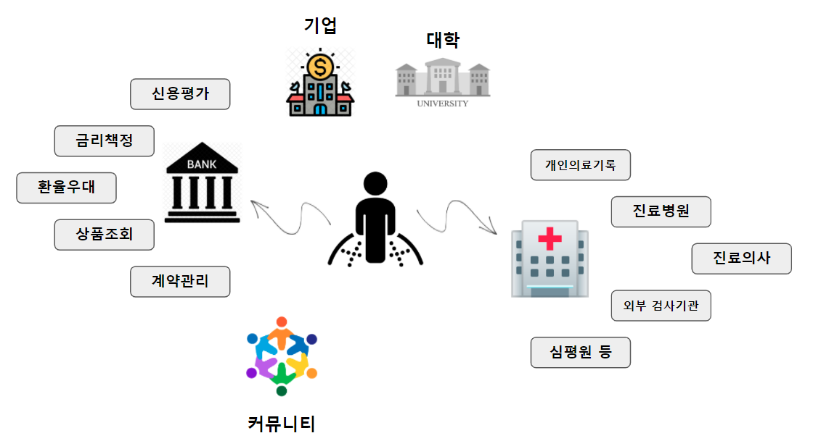
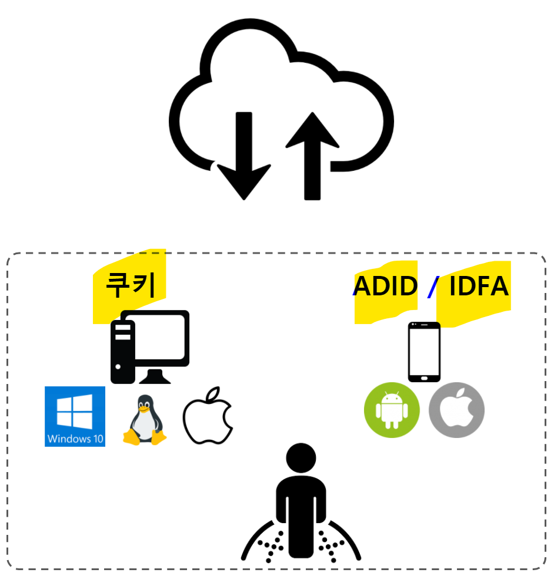
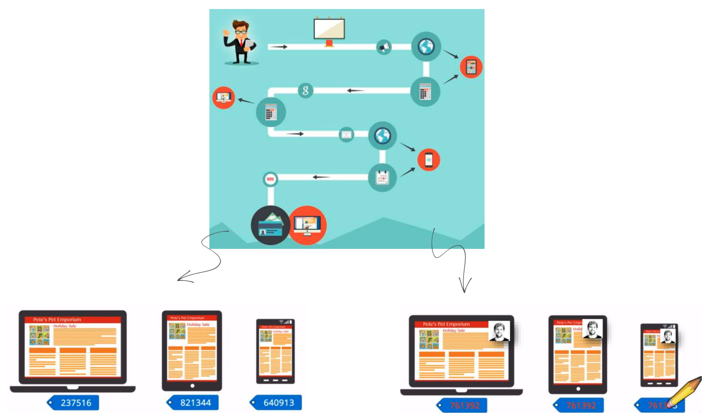

```{r setup, include=FALSE}
# Sys.setlocale("LC_CTYPE", "en_US.UTF-8")
knitr::opts_chunk$set(echo = FALSE, warning=FALSE, message=FALSE,
                    comment="", digits = 3, tidy = FALSE, prompt = FALSE, fig.align = 'center')
knitr::opts_knit$set(root.dir = rprojroot::find_rstudio_root_file())
```


# 데이터 경제 {#data-economy}

데이터 이코노미의 특징과 법제도적 이슈 - 고학수 (서울대학교 법학전문대학원)


# 문제 정의 {#problem-definition}

기존 개인정보는 은행을 가든 병원을 가든 개인이 소유한 정보가 은행과 병원을 통해 다양한 기관으로 이전되어 저장되어 관리되고 있다. 병원과 은행 뿐만 아니라 기업, 대학, 커뮤니티 등 다양한 기관에서 개인에 대한 정보를 여러가지 이유로 인해 보관하고 관리되고 있었다.



코즈정리(Corase Theorem)에는 "권리의 획정을 명확학 하면 자원의 효율적인 배분이 가능해질 것이기 때문에 데이터에 관한 소유권 개념이 명확하게 정해지면 데이터에 대한 접근이나 이용 등을 둘러싼 논란이 상당부분 해소될 것이다. 이를 다음 관점으로 나눠 살펴보고자 한다.

- 데이터에 대한 통제: 데이터 거버너슨(Data Governance)
- 데이터 경제: 거래비용(Transaction Cost)
- 개인정보: 프라이버시(Privacy)

Goldfarb & Tucker[@goldfarb2019digital]는 디지털 경제(Digital Economy)와 관련된 거래비용의 변화를 다음 5가지로 구분하였다.

- 추적비용 저하: Lower tracking costs
- 검색비용 저하: Lower search costs
- 복제비용 저하:Lower replication costs
- 배송비용 저하: Lower transportation costs
- 검증비용 저하: Lower verification costs

## 추적비용 [^cross-device-tracking] {#tracking-costs}

[^cross-device-tracking]: [Thomas Danniau @ gaucBE, "Cross-device tracking with Google Analytics", https://www.slideshare.net/TheReference/gauc-crossdevicetracking](https://www.slideshare.net/TheReference/gauc-crossdevicetracking)


데이터 경제의 부상으로 가장 두드러지는 특징은 추적비용(Tracking Cost)의 저하를 꼽을 수 있다. 인터넷 모바일 생태계 비즈니스 모델은 무료 서비스를 제공하고 광고를 통한 사업모델이 가장 흔하다. 그 다음으로 데스크톱 PC는 쿠키(Cookie), 모바일은 안드로이드와 애플 스마트폰 운영체제 각각 ADID와 IDFA를 통해 가입자를 식별하게 되고 구독(subscription)을 통해 회원가입을 하게 되면 식별된 정보를 바탕으로 추천서비스를 통해 구독경제를 가동시켜 매출을 창출하게 된다.

<center>

</center>

기기간 추적(Cross-Device Tracking)은 유비쿼터스 컴퓨팅이 출현한 이후 당연한 흐림이다. 즉, 고객이 하나의 디바이스만 사용하지 않고 서로 다른 다양한 디바이스를 사용하여 목적을 달성한다는 측면에서 서로 이질적인 기기간 추적이 함의하는 바는 무척이나 크다. 기기간 추적이 이뤄지지 않게 되면 노트북, 태블릿, 스마트폰으로 동일한 사람이 접속한 기록을 다른 사람으로 인식해서 추적하게 되는 반면 기기간 추적이 예를 들어 로그인 계정으로 추척된다면 동일인으로 식별하여 적절한 추천이나 광고 등 후속 작업을 추진할 수 있다.



## 검색비용 {#searching-costs}

탐색비용(search costs)는 고객이 제품을 찾는데 드는 노력의 비용이다. 
인터넷의 일상화와 구글이 출현하면서 만들어 놓은 높은 검색 정확성을 갖는 기술적 발전은 검색비용을 획기적으로 낮췄다. 
유용한 검색은 데이터의 가용성(Availability)과 검색 우선순위(Ranking)를 정하는 기술적인 발전과 경험이 전제되어야 한다.
검색비용이 낮춰지게 되면 어떤 변화가 생길까? 명확한 사실은 전반적인 가격 하락을 가져오지만 다른 한편으로는 가격의 편차는 많이 줄어들게 된다. 이외에도 롱테일 고객과 평균 고객에 대한 변화와 더불어 소비자에 대해 더 많은 것을 알게 되면서 맞춤형 제품과 서비스도 더 늘어날 것이다. 이와는 별개로 매칭(Matching) 시장의 발전도 기대된다.

## 복제비용 {#replication-costs}

디지털 재화(Digital Goods)는 본질적으로 복제를 아무리 많이 하더라도 품질의 저하가 일어나거나 사용성에 문제를 일으키지 않는다는 점에서 복제비용이 거의 없다. 이와 반대로 아날로그 데이터의 대표적인 복사는 복사 횟수에 따라 원본 문서의 품질이 아무리 좋은 복사기계를 사용하더라도 떨어지게 된다. 복제비용이 거의 들지 않는 이러한 기술을 기반으로 하는 비즈니스가 광고와 구독형 서비스다. 
"공공데이터"도 복제비용이 거의 소용되지 않는다는 특징으로 인해 공공재적인 특성을 갖고 있으며 공개를 해도 크게 문제가 없는 이유가 복제비용이 거의 없기 때문이다.

## 검증비용 {#verification cost}

디지털 전환(Digital Transformation)이 급격히 진행되면서 신원확인(Authenticaiton)과 평판(Repulation) 축적이 상대적으로 훨씬 수월해졌다. 이러한 검증비용의 저하는 인터넷을 통한 평판 시스템(Reputation System)이 동작할 공간을 열어두고 협업의 공간 함께 열었다.
하지만, 평판시스템은 신규 시장참여자를 막는 것은 물론이고, 소수 적극적인 의견 개진하는 소비자에 평판시장이 흘러가는 문제도 있으며 최근 블로거가 돈을 받고 특정 제품과 서비스를 홍보하는 사례 및 유튜브 뒷광고 사례등 부정적인 기능도 있다. 더욱이 악성 고객이 맘을 먹고 특정 개인이나 기업을 상대로 악행을 일삼는 경우도 종종 목격된다.

## 배송비용 {#transporation cost}

배송비용은 크게 두가지 측면에서 볼 수 있다. 생산자와 소비자를 직접 연결시킴으로써 일부 네트워크 통신비용만 감안하면 배송비용이 기존대비 크게 줄어든다. 오프라인 측면에서도 앞선 검색과 추적, 검증비용을 줄이는 데이터를 활용함으로써 공급자와 유통업체가 수요예측모형을 가동하여 최적화함으로써 재고 및 배송비용을 크게 줄일 수 있다.


